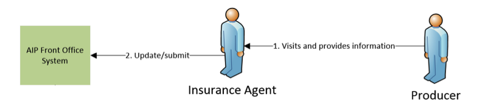
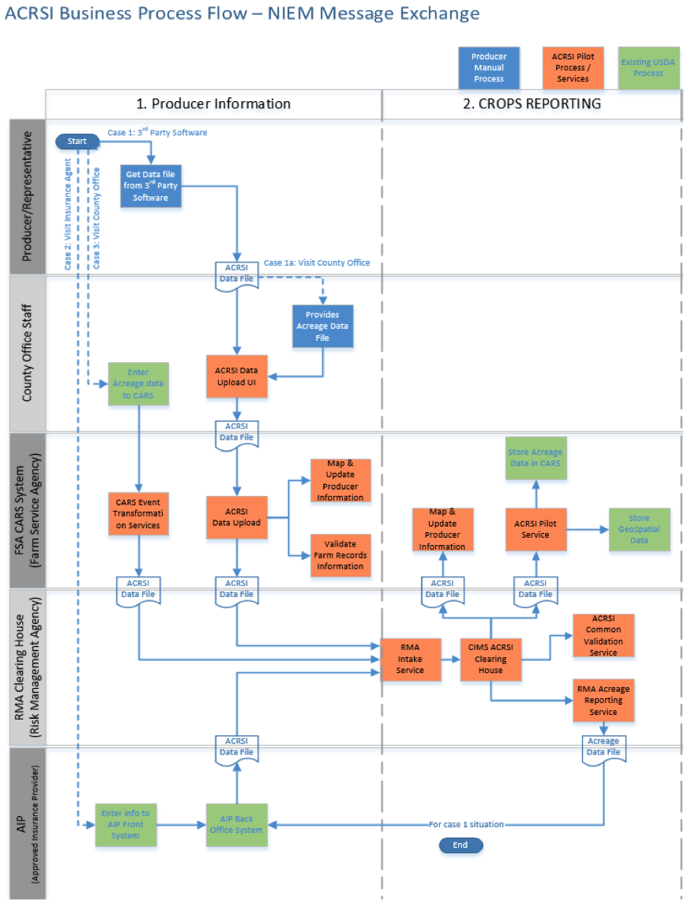
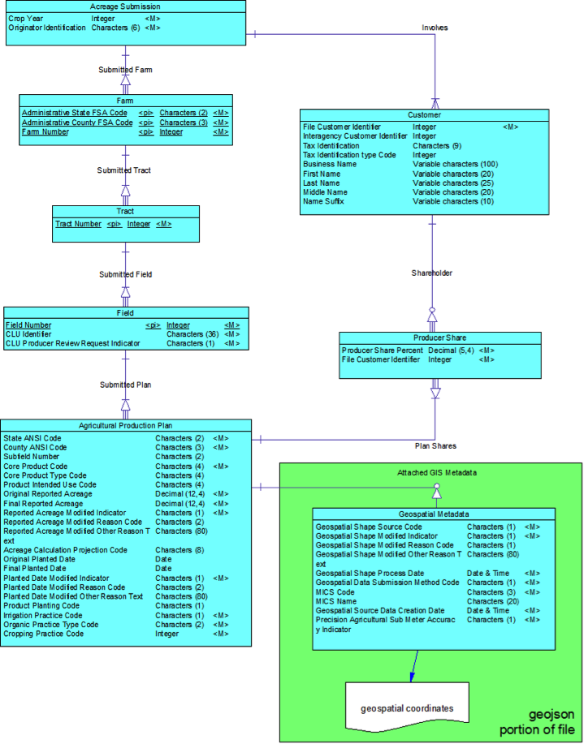
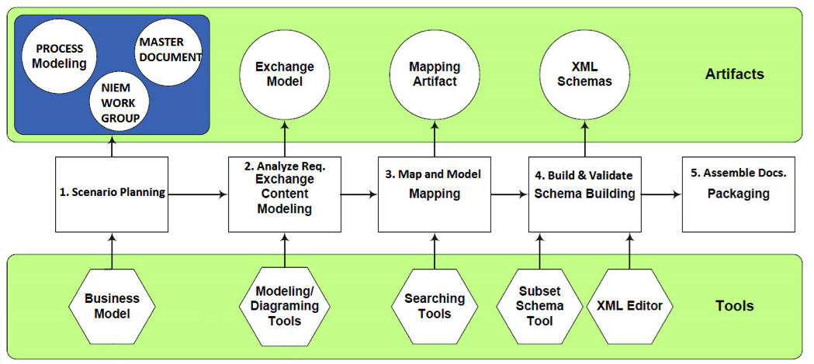

These are the __proposed__ data elements for Acreage Reporting to USDA.  No production development
should currently be done based on standards here.  For more information, please see [roadmap](../roadmap.html) or provide [feedback](../contribute.html).

* [Overview](#Background)      
* [Use Cases](#use_cases)    
* [Acreage and Crop Reporting Data Exchange](#data_exchange)   
* [Roles](#roles)   
* [Business Model](#business_model)  
* [Business Rules and Requirements](#business_rules)    
* [Business Process Diagram](#business_process)   
* [Exchange Content Model](#exchange_content)    
* [Development Methodology](#development_methodology)  

[View in Microsoft Word](ag-acrsi.iepd/documentation/NIEM-Master-Document-ACRSI.docx)

<a name="Background" />

# Overview 

Acreage Crop Reporting and Streamlining Initiative (ACRSI) is a project sponsored by the Deputy Undersecretary
 of Farm and Foreign Agricultural Services and the Department of Agriculture Chief Information Officer. 
The Farm Bill represents that upon request of the producer USDA electronically shares with the producers (or agents) 
in real time and without cost to the producers (or agents) the common land unit data, related farm level data, 
and other information of the producer.  

The vision of the USDA ACRSI is to "have a common USDA framework for producer commodity reporting 
in support of USDA programs."  This common framework will enable producers to report common data. 
The ACRSI project objective is to streamline the acreage reporting process for producers across USDA. 
The initiative is to simplify reporting processes, dates, data definitions, and develop data standards for 
commodities and associated data. 
The intention is to reduce the burden on the producer to participate in USDA programs while 
simultaneously improving program integrity and data sharing across USDA agencies. 
Once the data is reported, it will be available to and shared by the Farm Service Agency (FSA), 
the National Agricultural Statistic Service (NASS), the Natural Resources Conservation Service (NRCS), 
and the Risk Management Agency (RMA).  This capability will eliminate the need for producers to report the 
same information multiple times. 

<a name="use_cases"/>

# Use Cases

There are 3 use cases that are part of USDA ACRI Data Exchange file transmission, they are depicted below. 
Please refer to the Conceptual Architecture documentation below to see more detail architecture for each of 
the three cases.

**Use Case 1:** Producer through 3rd party software generates data file in specified standard, and upload the 
file through ACRSI Data Upload UI. Or the Producer could visit the County Office and provide the data file for 
the County Office to upload it through the same ACRSI Data Upload UI.

**Use Case 2:** Producer visits Insurance Agent and provides acreage data. Insurance Agent enters data through AIP system,
which then transforms the data into the specified standard, and sends it to USDA system.
 

**Use Case 3:** Producer or Representative provides acreage data to County Office Staff. The staff enters data through 
USDA CARS system, which then generates and transform the data into the specified standard, and sends it to 
USDA system.

<a name="data_exchange"/>

# Acreage and Crop Reporting Data Exchange

The Acreage Crop Reporting Streamlining Initiative (ACRSI) has a need to develop consistent data standards for
the sharing of information across USDA and its external partners. USDA must define a standard format for 
producers and third party data providers to upload Producer/Customer, acreage related data, including 
tabular and geospatial data. USDA FSA has chosen to standardize this information exchange through the use of 
NIEM standard. NIEM (National Information Exchange Model) is a federal industry community-driven, 
standards-based approach to exchanging information. At its core, NIEM has a data exchange model for 
establishing an agriculture domain to share Federal standards with other industries. 
The ACRSI team is working with USDA CIO to establish a sub domain for acreage and crop reporting which 
will be leveraged to share data exchange schema in an external public environment. The standard will allow 
industry to report on commodities based on a unified data exchange model for the 
Department while USDA continues to enable technology advances for consuming this information electronically.
<a name="Roles" />

# Roles

This USDA ACRSI NIEM Master Document focuses on data exchange interactions among Producers, Agent 
Representatives, County Offices, AIPs (Approved Insurance Providers), and USDA agencies primarily FSA 
(Farm Service Agency) and RMA (Risk Management Agency). 

## Producers/Agent Representatives

Producers or Agent Representatives participating in the ACRSI reporting will be required to submit all data elements required based on 
USDA Data Exchange Standards through the following methods:    

1.	Utilize 3rd party service to generate ACRSI data exchange file and submit the data file through 
USDA ACRSI Data Upload UI web-based application.  
2.	Or visit the designated County Office to interact with county staff to generate and submit the same 
ACRSI file, and upload the data file through the same USDA ACRSI Data Upload UI web-based application.  

## County Office

The producers who choose to report their data through a County Office will be required to submit all 
data elements based on the data standards established by USDA. County Office staff will assist Producers 
by uploading the generated data file through the same ACRSI Data Upload UI web-based application.

## USDA Farm Service Agency (FSA)

FSA receives the uploaded ACRSI data file from Producers or County Office, and further interacts with the following systems:  

1.	RMA Intake Service system for further processing within USDA RMA  
2.	Other FSA sub-systems for producer identification service to potentially update producer information  

## RMA (USDA Risk Management Agency)
Once the ACRSI data file is received, RMA Intake Service interact with CIMS ACRSI Clearing House system 
that will interact with other RMA sub-systems including:  

1.	FSA’s ACRSI Common Validation Service (CVS system) including transaction historical archival.  
2.	RMA’s Acreage Reporting service to generate Acreage Data to be sent to AIP (Approved Insurance Providers).  

## AIP (Approved Insurance Providers)
For AIPs that wish to participate in the ACRSI pilot, AIPs will collect from willing producers all 
data elements required that support both USDA Data Exchange Standards.

**Out of scope:** This NIEM Master document focuses on USDA ACRSI Data Exchange related messages that will be 
shared externally as listed above. It does not include other detail interactions within internal USDA systems 
such as eAuth, MIDAS, etc.

<a name="business_model"/>

# Business Model 

The Electronic Reporting pilot of ACRSI will provide a new producer self-service portal—a secure, 
public-facing, web-based platform tailored to serve the needs of farmers, rancher and producers 
(both owners and operators) who conduct business with USDA FSA.  This new Producer Portal will allow the 
Agency to meet the 2014 Farm Bill mandate that USDA, upon request of the producer, electronically shares 
with the producer (or agent) in real time and without cost to the producer (or agent ) the common land unit 
data, related farm level data, and other information of the producers. In addition, this new Producer Portal
will expand the Agency’s program delivery model, supplementing the current face-to-face customer service 
approach provided by skilled Field Operations staff.  USDA expects the primacy of the present human-mediated 
delivery model to continue for years to come because of the breadth and complexity of FSA’s current 
program portfolio.

<a name="business_rules"/>

# Business Rules

The ACRSI electronic data exchange component of ACRSI will allow external 
facing customers as well as internal agencies to develop software for data exchange with USDA. 
The development of NIEM domain and sub-domain for USDA ACRSI Reporting project could potentially enable 
USDA to exchange information with other federal agencies such as Emergency Management, International Trade, 
CBRN, etc.

ACRSI Data File assumptions:  

* File must pass all validations to be submitted; if any part of the file is not valid it cannot be submitted.  
* There will be no correction ability in the upload UI, file must be corrected offline and uploaded again.  
* File will include be in NIEM conformance structure leveraging USDA ACRSI sub-domain.  

Pilot Crops / Commodities (not validated by File Upload)  

* All crops are contained in the USDA CVS (Crop Validation Services)  
* Only crops with a single planting period will be in pilot  
* Only 2015 spring-seeded crops will be in pilot  
* Crops will  have a single reporting date of July 15  
* Crops cannot be repeat, subsequent, or double cropped  
* No crops filed late will be used  
* Farms will not have concurrent planting  
* Will only include a planting pattern of solid seeded  
* No hybrid corn crops  
* Will not include non-acre based (inventory) commodities  
 
<a href="data-elements/business_rules.html">This is a full list of business rules</a>

<a name="business_process"/>

# Business Process Diagram

Below is the business process diagram that depicts the interactions among the different actors in 
regards to ACRSI data exchange that is submitted by Producer or County Office.

The above business process diagram is a simplified version derived from the following 
“ACRSI Conceptual Architecture” 3 use cases focusing on ACRSI Data Exchange file.

<a name="exchange_content"/>

# Exchange Content Model

Below is the Exchange Content Model for USDA ACRSI:

<a name="development_methodology"/>

# Development Methodology

## Information Exchange Package Documentation

This USDA ACRSI NIEM IEPD contains a set of specifications that defines the content and structure of data 
file that is transmitted between Producers/Representative with USDA related systems. 
This IEPD is to support USDA Acreage Crop Reporting and Streamlining Initiative (ACRSI) project. 
It contains all the necessary artifacts within NIEM conformance standards. However, this IEPD does not 
specify the followings:  

* How the IEPD gets transmitted from one organization to USDA.
* How the sending system generates the IEPD.
* How the receiving system processes the IEPD.

## Tools and Methodologies

USDA follows the recommended NIEM Development methodologies using various tools as recommended while 
conforming to USDA IT Development team tools as depicted below:

The high-level methodologies utilized during the development are:  

**Scenario Planning**  

1. Gather information on the business context and usage of the exchange.  
2. Gather existing documentation such as business process diagram, current architecture, and data exchange specifications.

**Analyze Requirements**  

1. Exchange Content Modeling. Develop an exchange content model diagram per NIEM's recommendation, 
depicting data element hierarchies and relationships.  
2. Determine Business Rules and Requirements.

**Map and Model**    

1.  Map current business data exchange requirements to NIEM existing core schema components.  
2.  Identify and define NIEM extension components.  
3.  Map the remaining business data to newly defined extension components.  

**Build & Validate** 

1. Develop the NIEM Subset XML Schema file.  
2. Develop the Extension XML Schema file.  
3. Develop the Exchange XML Schema file.  
4. Develop a sample XML instance (IEP) file.  
5. Develop a sample Style Sheet file (if applicable).  
6. Verify all developed XML instance and XML Schema files are well-formed.  
7. Perform XML validation of the XML instance.  

**Assemble Documentations**  

1.  Analyze and/or review the artifacts to verify that the developed XML instance and XML Schema 
files are NIEM-conformant.  
2.  Assemble the artifacts into an IEPD including Master Document, Catalog, and Change Log.

## Testing and Conformance

USDA utilizes NIEM Naming and Design Rules (NDR) and Model Package Description (MPD) as adherence to predefined NIEM specific rules 
and guidelines throughout the "Build and Validate" phase. This conformance applies mainly to reference, 
exchange, and extension schemas, as well as XML instances as defined within NDR for NIEM 3.1 specifications.
The generated XML schemas are checked for conformance both manually and through the use of USDA development tools as there are no single tool exists that automates the whole process that adhere to NDR rules. Some of the conformance testing includes:

* XML instances are validated against XML schemas used within the exchange.  
* Each XML element must validate against the schema definition of the element.  
* XML instances may be validated through multiple schema validation passes, using multiple schemas for a single namespace.   
* The use of Schematron language to check against the latest version of the NIEM NDR.  
* Provides a summary report that contains a list   

## IEPD Artificats

1.	**Wantlist**
An XML document that specifies what components you want from the NIEM data model.
Can be consumed by and produced by the SSGT or other means.

2.	**Subset Schema**
A set of XML Schemas that defines the NIEM components used in your IEPD.
A subset of the entire NIEM data model.
Can be produced using the SSGT or other means.
Can add constraints to the Subset Schema for a separate constraint validation path.

3.	**Extension Schema**
A set of XML Schemas that define extended components.
A separate local namespace of components not contained in NIEM.

4.	**Exchange Schema**
The base document XML Schema that defines the XML root element and is generally named after the IEPD itself.

5.	**Sample XML Instances**
One or more sample IEPs that conform to the IEPD.
Can be used for additional understanding and testing.

6.	**Sample Stylesheets**
One or more sample XSLT stylesheets to show how an IEP might be transformed for display or other uses.
Can include sample output based on a Sample XML Instance.

